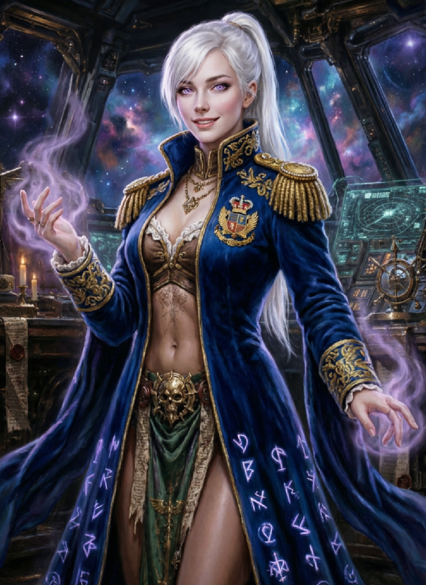

# W40KRT Audio Direct Mod

**Русская AI-озвучка для Warhammer 40,000: Rogue Trader**

Замена английской диалоговой озвучки на русскую через AI-генерацию (TTS) с голосовым клонированием. Работает через Unity Mod Manager — перехватывает текст диалогов и воспроизводит соответствующие WAV-файлы.

<p align="center">
  
</p>

[](Info.json)
[](catalog/people/index.yaml)
[](Localization/ruRU/)
[](catalog/people/)
[](config/voices.yaml)
[](W40KRTAudioDirectMod.csproj)
[](Info.json)

---

## О моде

Мод заменяет английскую озвучку диалогов в **Warhammer 40,000: Rogue Trader** на русскую, сгенерированную нейросетью **Qwen3-TTS Base** через механизм Voice Clone (Full ICL).

Каждый персонаж говорит голосом профессионального актёра дубляжа — голос клонирован по референсным записям дикторов.

### Как это работает

1. **Harmony-патчи** перехватывают `DialogVM.HandleOnCueShow` и `TMP_Text.set_text`
2. GUID диалоговой реплики сопоставляется с WAV-файлом в `Localization/ruRU/`
3. WAV воспроизводится через `winmm.dll mciSendString()` с регулировкой громкости
4. На время реплики приглушаются музыка и звуки (ducking) через Wwise RTPC

### Особенности

- Работает с любыми диалогами — сюжетными, побочными, случайными
- Настройка громкости озвучки в меню мода
- Регулировка приглушения игры (duck level) 0–100%
- Опция полного отключения английской озвучки
- Автоматический плавный возврат громкости после реплики

---

## Установка

1. Установите [Unity Mod Manager](https://www.nexusmods.com/site/mods/21) (v0.25+)
2. Скачайте последний релиз `W40KRTAudioDirectMod.dll`
3. Поместите в папку `%userprofile%\AppData\LocalLow\Owlcat Games\Warhammer 40000 Rogue Trader\UnityModManager\W40KRTAudioDirectMod\`
4. Скопируйте папку `Localization/ruRU/` туда же (содержит WAV-файлы озвучки)
5. Запустите игру через Unity Mod Manager

### Настройки

Параметры сохраняются в `Settings.xml`:

| Параметр | По умолчанию | Описание |
|---|---|---|
| `Volume` | 100 | Громкость озвучки (%) |
| `Language` | ruRU | Языковая папка для WAV |
| `DuckLevel` | 50 | Приглушение игры (%) |
| `MuteEnglishVoice` | true | Выключить английскую озвучку |

---

## Персонажи и актёры

| Персонаж | Актёр дубляжа | Фраз в каталоге |
|---|---|---|
| Narrator (Narrator) | Сергей Чонишвили | 4 374 |
| Abelard Werserian | Михаил Пшеничный | 403 |
| Heinrix van Calox | Никита Прозоровский | 410 |
| Pasqal Haneumann | Александр Клюквин | 408 |
| Sister Argenta | Елена Соловьёва | 382 |
| Idira Tlass | Аглая Шиловская | 412 |
| Cassia Orsellio | Анастасия Лапина | 656 |
| Jae Heydari | Ирина Киреева | 248 |
| Yrliet Lanaeviss | Лина Иванова | 329 |
| Kibellah | Ольга Голованова | 579 |
| Kunrad Voigtvir | Всеволод Кузнецов | 67 |
| Theodora von Valancius | Наталья Казначеева | 102 |
| Solomon Antar | Олег Куценко | 607 |
| Ulfar | Алексей Мясников | 358 |
| Marazhai Aezyrraesh | Сергей Чихачёв | 553 |
| Edelthrad | Иван Литвинов | — |
| Eogann | Андрей Кравец | 207 |
| Manipulus | Владимир Антоник | 204 |
| Trazyn | Вадим Медведев | 66 |
| Generic Male NPC | Денис Некрасов | 28 661 |

> **Всего:** 25 персонажей, 20 голосов, 39 408 фраз в каталоге

---

## Статус генерации

| Персонаж | Сгенерировано WAV |
|---|---|
| Kunrad Voigtvir | 66 |
| Theodora von Valancius | 99 |
| Narrator | 2 |
| Generic Male NPC | 1 |
| **Итого в игре** | **168** |

Также сгенерировано ~514 демо-файлов в `output/full_icl/` (в разработке).

---

## Технические детали

- **Язык:** C# (.NET 4.8.1)
- **Мод-менеджер:** Unity Mod Manager
- **Патчинг:** Harmony 2.x
- **Аудио:** winmm.dll / Wwise RTPC (SetRTPCValue)
- **TTS-модель:** Qwen3-TTS-12Hz-1.7B-Base (Full ICL / Voice Clone)
- **Голосовые референсы:** 22 образца профессиональных актёров дубляжа
- **Каталог фраз:** авто-парсинг из локализационных JSON + Wwise event names
- **Определение спикера:** двухстадийный алгоритм (Wwise events → narration fallback)

### Компиляция из исходников

```bash
compile.bat
```

Или через MSBuild:

```bash
msbuild W40KRTAudioDirectMod.csproj
```

---

## Структура репозитория

```
W40KRTAudioDirectMod/
├── Main.cs                     # Основной код мода (патчи, воспроизведение, ducking)
├── W40KRTAudioDirectMod.csproj # MSBuild проект
├── compile.bat                 # Сценарий компиляции
├── Info.json                   # Метаданные мода
├── Settings.xml                # Настройки
├── Localization/ruRU/          # WAV-файлы озвучки
├── catalog/people/             # Каталог фраз по персонажам (YAML)
├── config/
│   ├── default.yaml            # Конфигурация TTS
│   └── voices.yaml             # Маппинг голосов и актёров
├── tools/                      # Python-скрипты генерации
│   ├── qwen3_full_icl.py       # Генерация через Qwen3-TTS Voice Clone
│   ├── clone_voice.py          # Хелпер клонирования голоса
│   └── parse_blueprints.py     # Парсинг игровых данных
├── docs/characters/            # Описания персонажей
├── refs/samples/               # Референсные WAV актёров
└── assets/portraits/           # Портреты
```

---

## Использованные технологии

- [Qwen3-TTS](https://github.com/QwenLM/Qwen3-TTS) — Base модель для Voice Clone
- [Harmony](https://github.com/pardeike/Harmony) — IL-патчинг .NET
- [Unity Mod Manager](https://www.nexusmods.com/site/mods/21) — загрузчик модов
- Wwise (AkSoundEngine) — ducking звуков
- PowerShell / Python — инструменты генерации

---

## Лицензия

Проект распространяется для некоммерческого использования. Все WAV-файлы сгенерированы AI и не являются оригинальной озвучкой игры.

---

<p align="center">
  <a href="https://github.com/Domovikx/W40KRTAudioDirectMod">GitHub</a>
</p>
